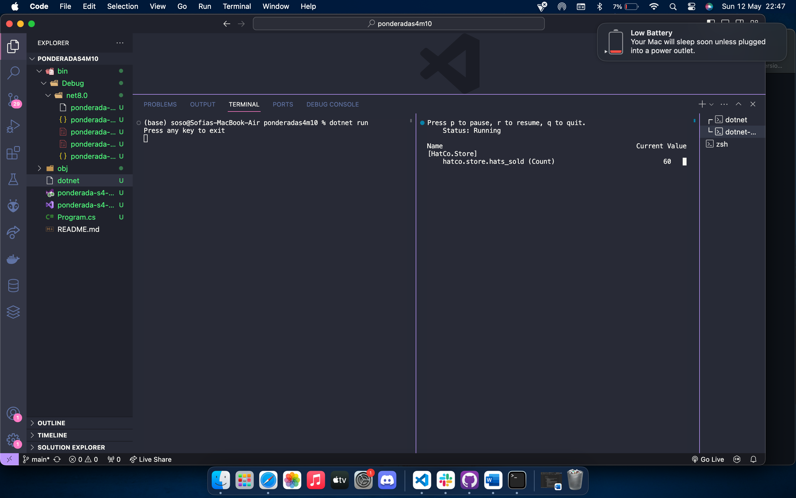

# ponderada-s4-m10

Esse relatório contempla as duas primeiras partes do tutorial presente neste link: https://learn.microsoft.com/pt-br/dotnet/core/diagnostics/metrics-instrumentation

## Primeira parte: criando métricas

Após seguir os passos para criar uma métrica da quantidade de chápeus vendidos por uma loja, e rodar os comandos necessários para iniciar a contagem da métrica, eu objetive esse resultado: 

    
     

## Segunda parte: obter um medidor por meio da injestão de dependência

Após seguir os passos dessa segunda parte, foi criada uma classe para simular os valores das métricas, a qual é possível acessar pelo nevagador:

### Código no backend rodando

    
     

### Localhost 

    
     

